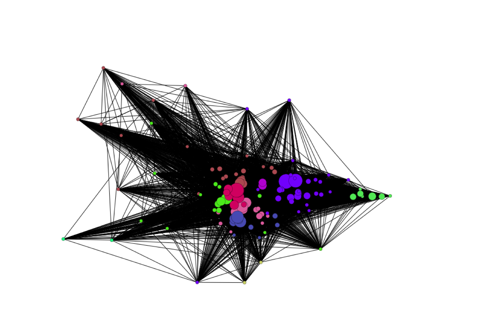

__Picture__: Hubway stations linked by rides between them, colored by community, normalized for distance. 

For my final project for [Albert-László Barabási's](https://en.wikipedia.org/wiki/Albert-L%C3%A1szl%C3%B3_Barab%C3%A1si) [Network Science Course](http://barabasilab.neu.edu/courses/phys5116/), I used network science techniques to model the [Hubway Bike network](https://secure.thehubway.com/map/). 

You can view the analysis [in this IPython Notebook](https://github.com/bcaine/Hubway-Network-Analysis/blob/master/hubway_network_analysis.ipynb).

