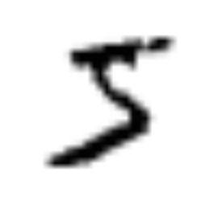
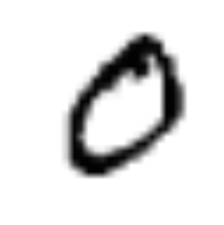
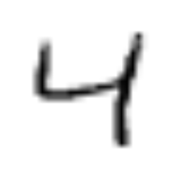
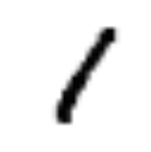
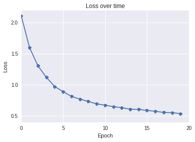
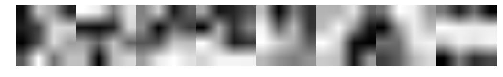
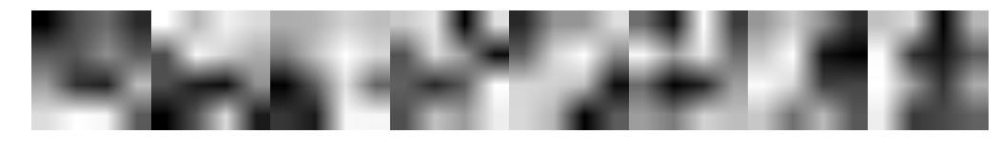

Training neural networks with both convolutional and recurrent layers end-to-end provides a nice framework to model many problems. Inputting a series of images, learning features, modeling temporal patterns, and outputting a vector (or value) at every timestep has a ton of interesting applications.

My main (longer term) motivation is exploring this is a larger project working towards automatic video summarization, using neural nets to extract scene information and figure out the frame-by-frame importance.

Anyway, as a starting point, I wanted to try a bunch of smaller models that allowed this type of end-to-end optimization. One very easy one to both understand and train is passing in a series of 1..N MNIST digits and calculating the sum of all the digit values added up.

### Input ###
For a given sequence of images like the following:

   

we want to train a neural network to calculate the sum, which in this case is **10** (I can add!).

### Model Creation ###
To create our model, I used [Keras](http://keras.io/), which is a very easy to use neural network library that runs on top of either Theano or Tensorflow. In particular, I use the [Time Distributed Branch](https://github.com/fchollet/keras/tree/timedistributed) which is still under development, but I found stable enough to use.

Here's our model:


```python
model = Sequential()
model.add(TimeDistributed(Convolution2D(8, 4, 4,
            border_mode='valid', activation='tanh'),
            input_shape=(max_to_add, 1, img_rows, img_cols)))
model.add(TimeDistributed(Convolution2D(16, 3, 3, 
            border_mode='valid', activation='tanh')))
model.add(TimeDistributed(Flatten()))
model.add(GRU(output_dim=200, return_sequences=True))
model.add(GRU(output_dim=100, return_sequences=False))
model.add(Dropout(0.2))
model.add(Dense(1))

# Then compile the model with MSE and RMSProp
model.compile(loss='mean_squared_error', optimizer='rmsprop')
```

The model parameters here are very arbitrary and suboptimal, which is fine for our purposes. The goal here is to test making time distributed convolutions and feeding these into a RNN, not to make the best number image summation tool. Something interesting to note is that using relu activations caused numeric instability, with the loss getting immediately stuck at infinity. Tanh did not have this problem.

The key is that each layer in Keras has a TimeDistributed Wrapper around it, which basically applies that step to all steps in the stack (so all images). This continues to happen until our TimeDistributed(Flatten()) which essentially flattens all the features out into a big matrix, and is fed into our RNN with GRU units.

Overall, the model works pretty well. With our max_to_add being set to 4, after 20 epochs our MSE on an evaluation set is 0.61, which is fairly small considering it is adding up to four digits from 0-9, meaning the result could be anywhere from 0 to 36.



### Visualizing the Process ###

The first layer consists of 8 4x4 weight matricies that are convolved with the image. What I really wanted to see is whether our convolution layers in our CNN->RNN model learn similar feature extractors to a similar model that uses softmax to predict a MNIST digit's value. 

__Pure__


__CNN-RNN__



