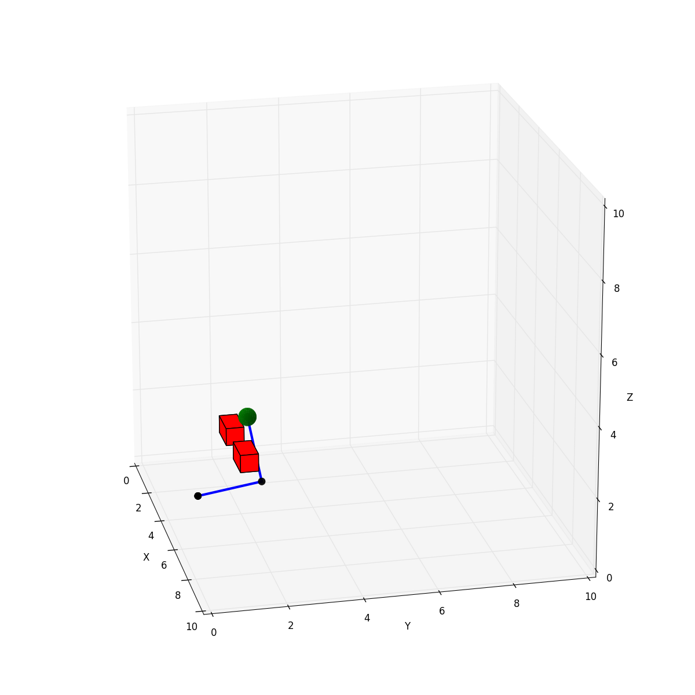
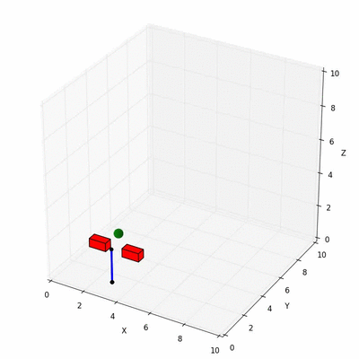

Maddux is a flexible robot manipulator simulation environment written in pure Python. It was created to make it easy to experiment with different learning algorithms to have a robot arm perform various tasks. Maddux was written by [Colin Kohler](https://github.com/ColinKohler) and I as part of our final project for [Robert Platt's Robotics Course](http://www.ccs.neu.edu/home/rplatt/cs5335_2016/index.html).

#### Maddux Supports

* Arbitrary Length Arms
* Forward Kinematics
* Inverse Kinematics
* Simulation Environment (with objects like Balls, Targets, Obstacles)
* 3D Environment Animations
* 3D Arm Animations
* End Effector Position, Velocity

Documentation: http://bencaine.me/maddux/
Source: https://github.com/bcaine/maddux/

#### Plotted Arm with Obstacles

#### Animated Arm (Trained via Reinforcement Learning)

